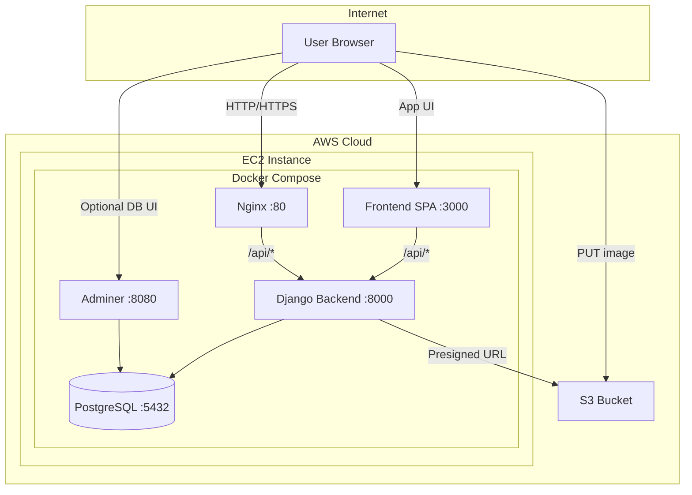
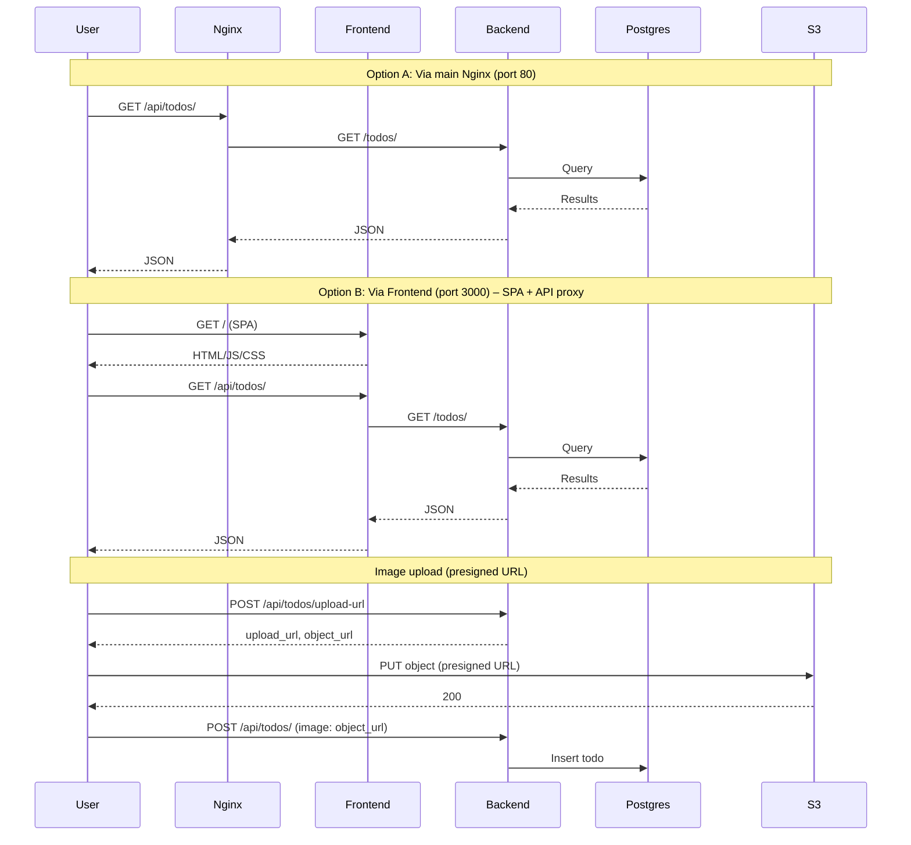
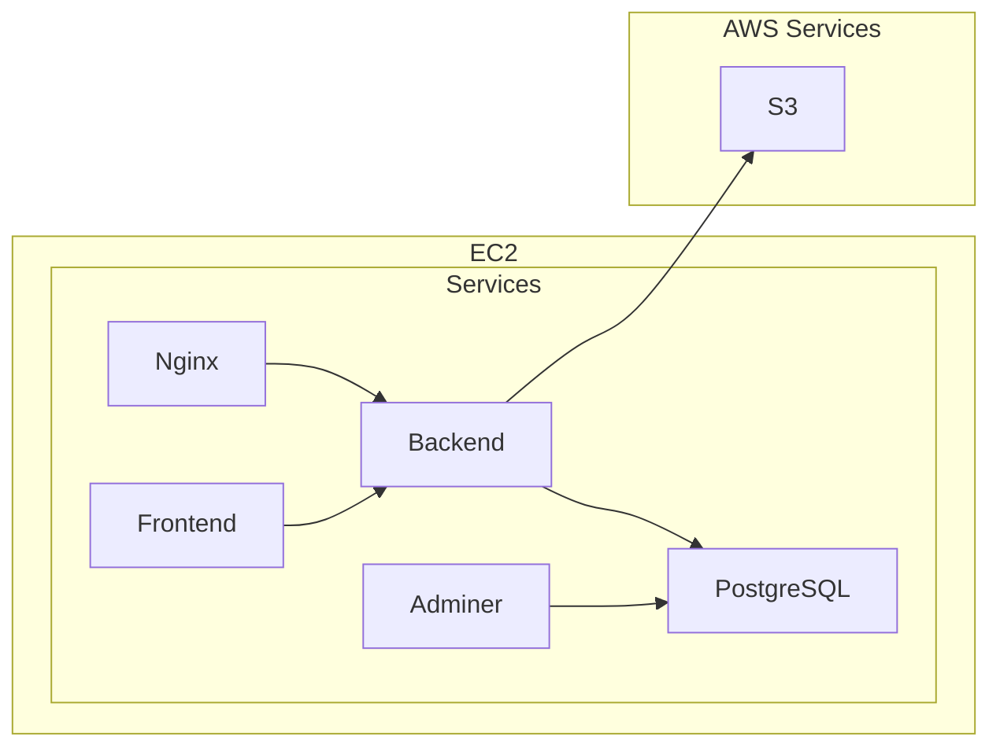
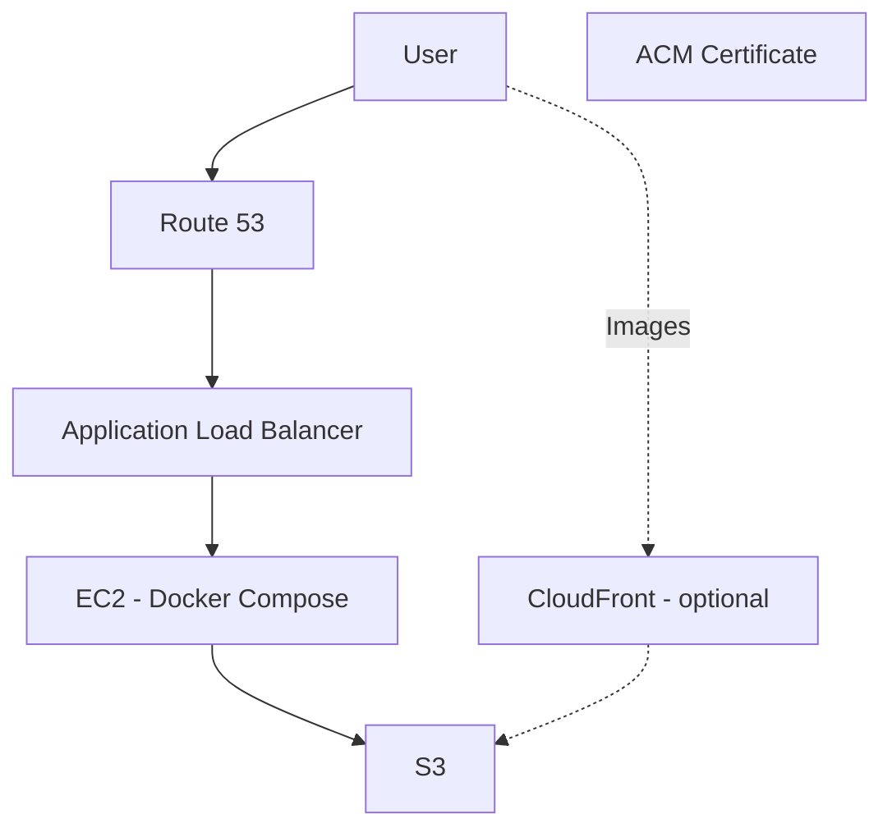

# Architecture Diagram (AWS EC2)

## High-level architecture

```mermaid
flowchart TB
  subgraph internet [Internet]
    User[User Browser]
  end

  subgraph aws [AWS Cloud]
    subgraph ec2 [EC2 Instance]
      subgraph docker [Docker Compose]
        Nginx[Nginx :80]
        Frontend[Frontend SPA :3000]
        Backend[Django Backend :8000]
        Postgres[(PostgreSQL :5432)]
        Adminer[Adminer :8080]
      end
    end

    S3[S3 Bucket]
  end

  User -->|HTTP/HTTPS| Nginx
  User -->|App UI| Frontend
  Frontend -->|/api/*| Backend
  Nginx -->|/api/*| Backend
  Backend --> Postgres
  Backend -->|Presigned URL| S3
  User -->|PUT image| S3
  User -->|Optional DB UI| Adminer
  Adminer --> Postgres
```

## Request flow

```mermaid
sequenceDiagram
  participant User
  participant Nginx
  participant Frontend
  participant Backend
  participant Postgres
  participant S3

  Note over User,S3: Option A: Via main Nginx (port 80)
  User->>Nginx: GET /api/todos/
  Nginx->>Backend: GET /todos/
  Backend->>Postgres: Query
  Postgres-->>Backend: Results
  Backend-->>Nginx: JSON
  Nginx-->>User: JSON

  Note over User,S3: Option B: Via Frontend (port 3000) – SPA + API proxy
  User->>Frontend: GET / (SPA)
  Frontend-->>User: HTML/JS/CSS
  User->>Frontend: GET /api/todos/
  Frontend->>Backend: GET /todos/
  Backend->>Postgres: Query
  Postgres-->>Backend: Results
  Backend-->>Frontend: JSON
  Frontend-->>User: JSON

  Note over User,S3: Image upload (presigned URL)
  User->>Backend: POST /api/todos/upload-url
  Backend-->>User: upload_url, object_url
  User->>S3: PUT object (presigned URL)
  S3-->>User: 200
  User->>Backend: POST /api/todos/ (image: object_url)
  Backend->>Postgres: Insert todo
```

## Component diagram

```mermaid
flowchart LR
  subgraph ec2 [EC2]
    subgraph services [Services]
      N[Nginx]
      F[Frontend]
      B[Backend]
      P[PostgreSQL]
      A[Adminer]
    end
  end

  subgraph aws_services [AWS Services]
    S3[S3]
  end

  N --> B
  F --> B
  B --> P
  B --> S3
  A --> P
```

## Production variant (optional: ALB + HTTPS)

```mermaid
flowchart TB
  User[User]
  Route53[Route 53]
  ACM[ACM Certificate]
  ALB[Application Load Balancer]
  EC2[EC2 - Docker Compose]
  S3[S3]
  CloudFront[CloudFront - optional]

  User --> Route53
  Route53 --> ALB
  ALB --> EC2
  EC2 --> S3
  User -.->|Images| CloudFront
  CloudFront -.-> S3
```
