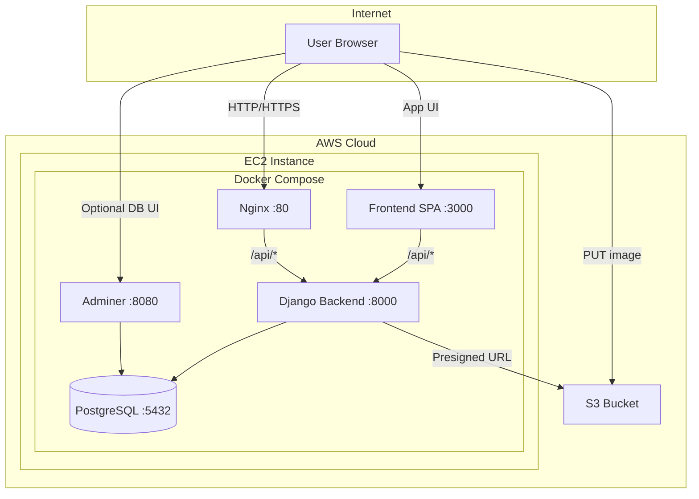
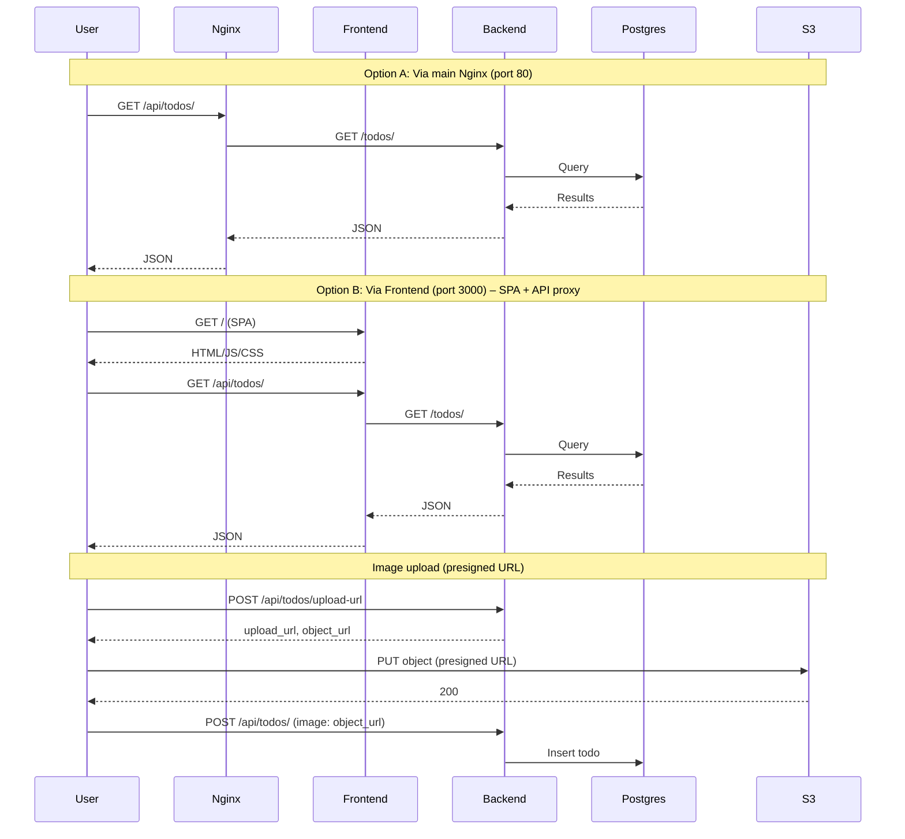
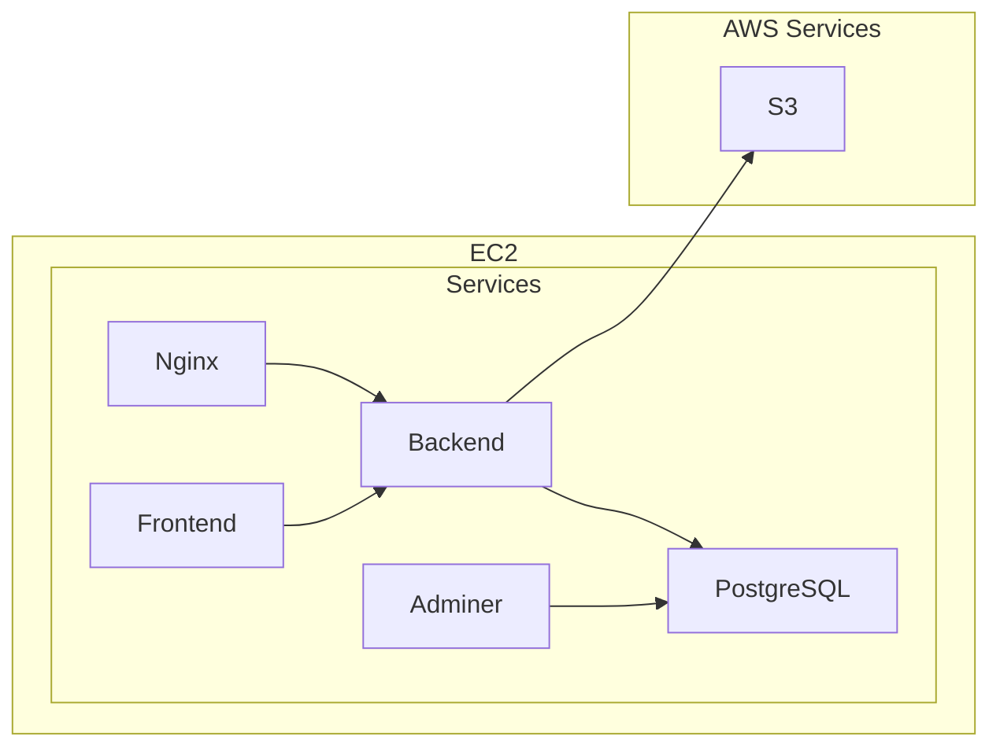

# Todo App – React, Django, PostgreSQL, S3

A full-stack Todo application with a React frontend, Django REST API, PostgreSQL, and AWS S3 for image uploads. Designed to run with Docker Compose and to be hosted on **AWS EC2**.

---

## Table of contents

- [Todo App – React, Django, PostgreSQL, S3](#todo-app--react-django-postgresql-s3)
    - [Table of contents](#table-of-contents)
    - [Quick start](#quick-start)
    - [Architecture](#architecture)
        - [High-level architecture (AWS EC2)](#high-level-architecture-aws-ec2)
        - [Request flow](#request-flow)
        - [Component diagram](#component-diagram)
    - [Components](#components)
    - [Environment variables](#environment-variables)
        - [Backend (Django)](#backend-django)
        - [Frontend (build-time)](#frontend-build-time)
    - [Deployment on AWS EC2](#deployment-on-aws-ec2)
        - [Prerequisites](#prerequisites)
        - [Steps](#steps)
        - [S3 setup (summary)](#s3-setup-summary)
        - [Optional: single entry point on port 80](#optional-single-entry-point-on-port-80)
    - [API reference](#api-reference)
    - [Repository layout](#repository-layout)
    - [Security](#security)
    - [Troubleshooting](#troubleshooting)

---

## Quick start

**Prerequisites:** Docker and Docker Compose.

1. Clone the repo and create a `.env` file in the project root (see [Environment variables](#environment-variables)).
2. Run the stack:

    ```bash
    docker compose up -d --build
    ```

3. Run migrations (first time only):

    ```bash
    docker compose exec backend python manage.py migrate
    ```

4. Open the app at **http://localhost:3000** (or **http://localhost/api/** for API-only via Nginx on port 80).

---

## Architecture

### High-level architecture (AWS EC2)



### Request flow



### Component diagram



---

## Components

| Component      | Technology              | Port (host)     | Role                                             |
| -------------- | ----------------------- | --------------- | ------------------------------------------------ |
| **Nginx**      | nginx:alpine            | 80              | Reverse proxy; forwards `/api/` to Django.       |
| **Frontend**   | React (Vite), nginx     | 3000            | SPA; serves UI and proxies `/api/` to backend.   |
| **Backend**    | Django + DRF + Gunicorn | (internal 8000) | REST API: todos CRUD, health, S3 presigned URLs. |
| **PostgreSQL** | postgres:16-alpine      | 5432            | Persistent data store.                           |
| **Adminer**    | adminer:latest          | 8080            | Web UI for database management.                  |
| **S3**         | AWS S3                  | —               | Image uploads (browser → S3 via presigned URL).  |

**Traffic:**

- **Port 80 (Nginx):** Proxies `/api/*` to the backend only (no SPA unless you add it to Nginx config).
- **Port 3000 (Frontend):** Full app: SPA + `/api/*` proxy to backend. Use `http://<host>:3000` for the UI.

**Data flow (summary):**

- API: Client → Nginx or Frontend → Backend → PostgreSQL.
- Image upload: Client asks Backend for presigned URL → Client uploads file to S3 → Client sends todo with image URL to Backend → Backend stores URL in PostgreSQL.

---

## Environment variables

Create a `.env` file in the project root. Docker Compose substitutes these into the backend (and optionally frontend build).

### Backend (Django)

| Variable                  | Description                | Example / note                                    |
| ------------------------- | -------------------------- | ------------------------------------------------- |
| `SECRET_KEY`              | Django secret              | Strong random value in production                 |
| `DEBUG`                   | Debug mode                 | `False` on EC2                                    |
| `ALLOWED_HOSTS`           | Comma-separated hosts      | `your-domain.com,ec2-xx-xx.compute.amazonaws.com` |
| `POSTGRES_HOST`           | DB host                    | `postgres` (Compose service name)                 |
| `POSTGRES_PORT`           | DB port                    | `5432`                                            |
| `POSTGRES_DB`             | Database name              | `app`                                             |
| `POSTGRES_USER`           | DB user                    | `app`                                             |
| `POSTGRES_PASSWORD`       | DB password                | Strong password                                   |
| `AWS_ACCESS_KEY_ID`       | IAM key for S3             | From IAM user                                     |
| `AWS_SECRET_ACCESS_KEY`   | IAM secret                 | From IAM user                                     |
| `AWS_STORAGE_BUCKET_NAME` | S3 bucket name             | `my-todo-images`                                  |
| `AWS_S3_REGION_NAME`      | AWS region                 | `us-east-1`                                       |
| `AWS_S3_CUSTOM_DOMAIN`    | Optional (e.g. CloudFront) | `d123.cloudfront.net`                             |
| `CORS_ALLOWED_ORIGINS`    | Allowed frontend origins   | `http://localhost:3000,https://your-domain.com`   |

### Frontend (build-time)

| Variable              | Description                      | Example                       |
| --------------------- | -------------------------------- | ----------------------------- |
| `VITE_IMAGE_BASE_URL` | Optional CDN base for image URLs | `https://d123.cloudfront.net` |

Do not commit `.env`; use a `.env.example` as a template.

---

## Deployment on AWS EC2

### Prerequisites

- EC2 instance (e.g. Amazon Linux 2 or Ubuntu) with Docker and Docker Compose.
- Security group: inbound **80** (HTTP), **3000** (app), **8080** (Adminer; optional), **22** (SSH).
- Optional: Route 53 (or other DNS) pointing to the EC2 public IP.
- S3 bucket with CORS and bucket policy (or CloudFront) for upload and read.

### Steps

1. **Launch EC2** and configure the security group as above.

2. **Install Docker & Docker Compose** (example for Amazon Linux 2):

    ```bash
    sudo yum update -y
    sudo yum install -y docker
    sudo systemctl start docker && sudo systemctl enable docker
    sudo usermod -aG docker ec2-user
    sudo curl -L "https://github.com/docker/compose/releases/latest/download/docker-compose-$(uname -s)-$(uname -m)" -o /usr/local/bin/docker-compose
    sudo chmod +x /usr/local/bin/docker-compose
    ```

3. **Clone the repo** and add a `.env` file with production values (see [Environment variables](#environment-variables)).

4. **Run the stack:**

    ```bash
    docker compose up -d --build
    ```

5. **Run migrations** (first run only):

    ```bash
    docker compose exec backend python manage.py migrate
    ```

6. **Access:**
    - App (SPA + API): **http://&lt;ec2-public-ip&gt;:3000**
    - API only: **http://&lt;ec2-public-ip&gt;:80/api/**
    - Adminer: **http://&lt;ec2-public-ip&gt;:8080** (restrict or disable in production).

### S3 setup (summary)

- Create a bucket; set CORS to allow `PUT`/`GET` and your frontend origins (e.g. `http://localhost:3000`).
- For public read of images: bucket policy allowing `s3:GetObject` for the upload prefix, or use CloudFront and set `AWS_S3_CUSTOM_DOMAIN` / `VITE_IMAGE_BASE_URL`.
- IAM user for the backend needs `s3:PutObject` (and optionally `s3:GetObject`) on that bucket; provide keys via `AWS_ACCESS_KEY_ID` and `AWS_SECRET_ACCESS_KEY`.

### Optional: single entry point on port 80

To serve both the SPA and the API on port 80:

1. Build the frontend and serve its output from the main Nginx (e.g. via volume or custom image).
2. In `nginx/nginx.conf`: keep `location /api/` proxying to `http://backend:8000/`, and add `location /` that serves the SPA with `try_files $uri $uri/ /index.html;`.

---

## API reference

| Method | Path                    | Description                                                    |
| ------ | ----------------------- | -------------------------------------------------------------- |
| GET    | `/api/health`           | Health check                                                   |
| GET    | `/api/todos/`           | List todos                                                     |
| POST   | `/api/todos/`           | Create todo                                                    |
| GET    | `/api/todos/<id>`       | Get todo                                                       |
| PUT    | `/api/todos/<id>`       | Update todo                                                    |
| DELETE | `/api/todos/<id>`       | Delete todo                                                    |
| POST   | `/api/todos/upload-url` | Get S3 presigned upload URL (body: `filename`, `content_type`) |

---

## Repository layout

```
.
├── docker-compose.yml       # Service definitions
├── nginx/
│   └── nginx.conf           # Main reverse proxy
├── backend/                  # Django app
│   ├── Dockerfile
│   ├── config/               # Settings, URLs
│   └── todos/                # App + S3 presign
├── frontend/                 # React app
│   ├── Dockerfile
│   ├── nginx.conf            # SPA + /api proxy
│   └── src/
└── docs/
    ├── ARCHITECTURE.md       # Diagrams only
    └── TECHNICAL_DOCUMENTATION.md
```

---

## Security

- Set **DEBUG=False** and a strong **SECRET_KEY** in production.
- Restrict **ALLOWED_HOSTS** to your domain(s) and EC2 hostname.
- Use a strong **POSTGRES_PASSWORD** and limit or disable Adminer in production.
- Prefer **HTTPS**: put an ALB or CloudFront in front and redirect HTTP → HTTPS.
- Restrict security groups (do not expose 5432 or 8000 to the internet).
- Keep secrets in `.env` or a secrets manager; do not commit them.

---

## Troubleshooting

| Issue                    | What to check                                                                                                               |
| ------------------------ | --------------------------------------------------------------------------------------------------------------------------- |
| **CORS (API)**           | Ensure `CORS_ALLOWED_ORIGINS` includes the origin the browser uses (e.g. `http://<ec2>:3000`).                              |
| **CORS (S3)**            | Configure bucket CORS for the frontend origin and methods `PUT`/`GET`.                                                      |
| **Images not loading**   | S3 bucket (or CloudFront) must allow public read for image URLs, or set `VITE_IMAGE_BASE_URL` to a CDN that can serve them. |
| **502 Bad Gateway**      | Backend container running; Nginx/Frontend can resolve `backend:8000` on the Compose network.                                |
| **DB connection errors** | Correct `POSTGRES_*` env vars; backend can reach the `postgres` service; run migrations if the DB is new.                   |
